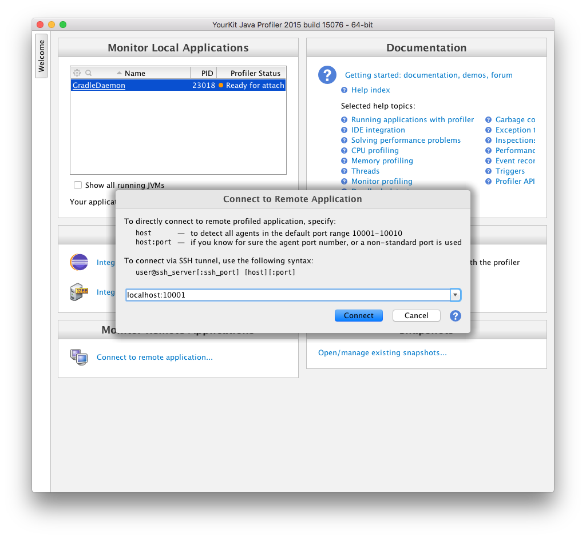

# Paketo Buildpack for YourKit

## Buildpack ID: `paketo-buildpacks/yourkit`
## Registry URLs: `docker.io/paketobuildpacks/yourkit`
The Paketo Buildpack for YourKit is a Cloud Native Buildpack that contributes the [YourKit][y] Agent and configures it to
connect to the service.

[y]: https://www.yourkit.com

## Behavior

This buildpack will participate if all the following conditions are met

* `$BP_YOURKIT_ENABLED` is set

The buildpack will do the following at build time:

* Contributes a Java agent to a layer
* Contributes a helper that configures the agent at runtime

The helper binary runs at launch time and executes before your application. It reads the `BPL_*` configuration settings and uses them to configure the YourKit agent.

## Configuration

| Environment Variable | Description
| -------------------- | -----------
| `$BP_YOURKIT_ENABLED` | Whether to contribute YourKit support
| `$BPL_YOURKIT_ENABLED` | Whether to enable YourKit support
| `$BPL_YOURKIT_PORT` | Configure the port the YourKit agent will listen on. Defaults to `10001`.
| `$BPL_YOURKIT_SESSION_NAME` | Configure the session's name.

## Bindings

The buildpack optionally accepts the following bindings:

### Type: `dependency-mapping`

|Key                   | Value   | Description
|----------------------|---------|------------
|`<dependency-digest>` | `<uri>` | If needed, the buildpack will fetch the dependency with digest `<dependency-digest>` from `<uri>`

## Publishing the Port

When starting an application with the YourKit Profiler enabled, a port must be published.  To publish the port in Docker, use the following command:

```bash
$ docker run --publish <LOCAL_PORT>:<REMOTE_PORT> ...
```

The `REMOTE_PORT` should match the `port` configuration for the application (`10001` by default).  The `LOCAL_PORT` can be any open port on your computer, but typically matches the `REMOTE_PORT` where possible.

Once the port has been published, your YourKit Profiler should connect to `localhost:<LOCAL_PORT>` for profiling.



## Binary Availability

YourKit publishes new versions of their product at `download.yourkit.com`, but then moves older versions to `archive.yourkit.com`. It is not possible for buildpacks to change the URL of a download once the buildpack version has been published. Thus when YourKit moves binaries from one domain to the other, it breaks old buildpacks.

If you stay on the most recent buildpack version, you should always get the most recent version of YourKit which should download just fine. However, if you need to use an older version of the buildpack, perhaps because your YourKit license is capped at a particular YourKit version, then you will need to take the additional step of adding a dependency mirror to access those binaries on `archive.yourkit.com`.

To add a [dependency mirror](https://paketo.io/docs/howto/configuration/#dependency-mirrors), you need to set the env varable `BP_DEPENDENCY_MIRROR_DOWNLOAD_YOURKIT_COM` to `https://archive.yourkit.com` when you build your application.

For example, if we wanted to use YourKit buildpack version 6.4.6:

```
pack build, -e BP_DEPENDENCY_MIRROR_DOWNLOAD_YOURKIT_COM=https://archive.yourkit.com -e BP_YOURKIT_ENABLED=true -b urn:cnb:builder:paketo-buildpacks/java -b paketo-buildpacks/yourkit@6.4.6.
```

You may also use a [dependency mapping](https://paketo.io/docs/howto/configuration/#dependency-mappings) to change the download URL, however, this process requires a little more work and is specific to only one particular dependency. See the documention if you'd like to use this approach.

## License

This buildpack is released under version 2.0 of the [Apache License][a].

[a]: http://www.apache.org/licenses/LICENSE-2.0
